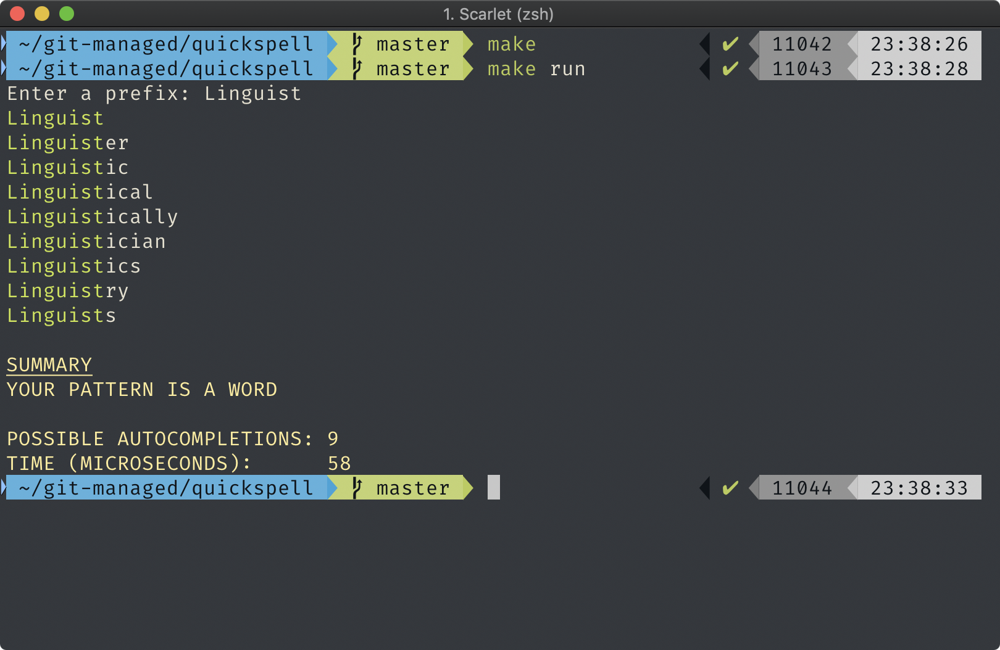

## QuickSpell
QuickSpell is a simple and minimal spellchecker written in `C++` programming language. The implementation heavily relies on two data structures: bloom filter and trie. Trie is used for finding all possible autocompletions as well as for finding whether the entered pattern is a word. Bloom filter, on the other hand, is used to quickly verify that the given pattern is not a word. Note that word *pattern* refers to the possible prefix of the word(s) that user has to enter in order to get all the autocompletions.

### Running
```sh
git clone https://github.com/oniani/quickspell.git
cd quickspell
make
make run    # at this point, the user is prompted to enter a pattern
make clean  # if one wants to get rid of the executables
```

For further clarification, see the example below.



### How it works
QuickSpell looks in the dictionary file which is located in the `data` folder (yes, the better the dictionary, the better the autocompletions). Once the user enters the pattern, the program tries to find all matches that start with the given prefix. If it happened that there are no matches, no autocompletions will be printed out. Whether the pattern is a word or not will be indicated in the *Summary* section of the output. The number of possible autocompletions and the time the program took to find these autocompletions will also be printed out.


### References
1. [Bloom filter - Wikipedia](https://en.wikipedia.org/wiki/Bloom_filter)
1. [Trie - Wikipedia](https://en.wikipedia.org/wiki/Trie)
3. [C++ - Wikipedia](https://en.wikipedia.org/wiki/C%2B%2B)
